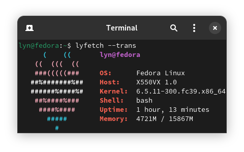

Lyfetch is a small and quick system info script because strawberries are cute.



## Installation:
```bash
git clone https://github.com/its-Lyn/lyfetch
cd lyfetch

sudo make install
```
To uninstall lyfetch, run:
```bash
sudo make uninstall
```
