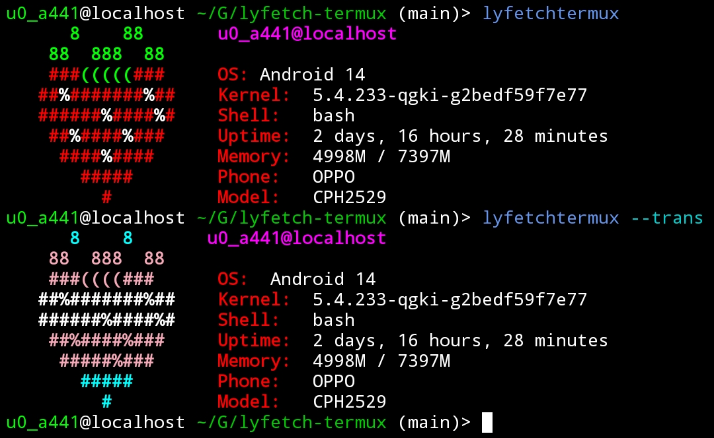

Lyfetch is a small and quick system info script because strawberries are cute.

This time it's on termux because why not!



## Installation:
```bash
git clone https://github.com/bikoil/lyfetch-termux
cd lyfetch-termux

make install
```
Then run:
```bash
lytermux
```
To uninstall lytermux, run:
```bash
make uninstall
```
- [Original Repository](https://github.com/its-lyn/lyfetch)
